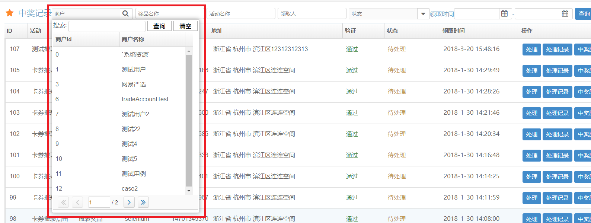

使用use属性扩展原有组件
--------------
  除<apply/>、<foreach/>等shadow element之外, zkoss的每个xul/html标签都有一个与之对应的Java类,Java类中有与标签的属性对应的getter/setter方法。我们可以通过继承并重写特定方法的方式，在设值和取值过程中添加一些处理逻辑，也可以添加getter/setter方法来增加自定义的xul标签属性。
  
  实现一个自动去除两端空白的textbox
   - java类
   
		```java
		package com.example.demo.zk.component;
		
		import org.zkoss.zk.ui.WrongValueException;
		import org.zkoss.zul.Textbox;

		public class TrimedTextbox extends Textbox {
		    @Override
		    public String getValue() throws WrongValueException {
		        final String value = super.getValue();
		        return value == null ? null : value.trim();
		    }
		}
		```
   - 页面文件 
		```xml
		<div viewModel="@id('vm') @init('com.example.demo.zk.vm.IndexVM')">
		    <textbox value="@bind(vm.foo)" use="com.example.demo.zk.component.TrimedTextbox"/>
		</div>
		```
  - 添加一个自定义属性trim，值为true时去掉两端空白
   - java类
       
   ```java
    public class TrimedTextbox extends Textbox {
        boolean trim = false;
    
        @Override
        public String getValue() throws WrongValueException {
            final String value = super.getValue();
            return trim && value != null ? value.trim(): value;
        }
    
        public boolean isTrim() {
            return trim;
        }
    
        public void setTrim(boolean trim) {
            this.trim = trim;
        }
    }
   ```
        
   - 页面文件 
   
  ```xml
    <div viewModel="@id('vm') @init('com.example.demo.zk.vm.IndexVM')">
        <textbox value="@bind(vm.foo)" trim="true" use="com.example.demo.zk.component.TrimedTextbox"/>
    </div>
   ```
     
   - 以自定义组件的方式使用
   ```xml
    <?component name="trimedtext" class="com.example.demo.zk.component.TrimedTextbox"?>
    <div viewModel="@id('vm') @init('com.example.demo.zk.vm.IndexVM')">
        <trimedtext value="@bind(vm.foo)" trim="true"/>
    </div>
   ```
   - 自定义属性的数据绑定支持
   
     通过以上方式添加的自定义属性是不支持数据绑定的， 可以通过注解`@ComponentAnnotation({"propertyName1:@ZKBIND(ACCESS=both, SAVE_EVENT=eventName1)","propertyName2:@ZKBIND(ACCESS=both, SAVE_EVENT=eventName2)"})`添加双向绑定支持, 其中`propertyName1`、`propertyName2`为属性名，`eventName1`、`eventName2`为触发保存的事件名。
     
     以一个扩展自`Bandbox`，实现带查询功能的下拉选择组件抽象类为例
     
     1. 给java类添加注解,如
         ```java
            @ComponentAnnotation({"selectedItem:@ZKBIND(ACCESS=both, SAVE_EVENT=onChange)","selectedId:@ZKBIND(ACCESS=both, SAVE_EVENT=onChange)"})
            public abstract class SelectorBandbox<T> extends Bandbox implements IdSpace{
             //...
            }
         ```
     
        当`Bandbox`元素监听到`onChange`事件后，触发`selectedItem`和`selectedId`的保存动作。
        
     2. 在对应值产生变化的时候发布`onchange`事件(Post event)。 `Events.postEvent(Events.ON_CHANGE, this, selectedItem);`
        
        **特别注意：setter内的事件发布前一定要判断新值与原值是否相同，否则可能会产生死循环。因为双向绑定时save完成后会自动load一次，调用组件的setter方法，如果此时不加判断直接再发布一个事件，则会导致再次save-load并陷入循环**
     
     完整代码
     
     ```java
        package com.hx.zkoss;
        
        import com.baomidou.mybatisplus.plugins.Page;
        import org.slf4j.Logger;
        import org.slf4j.LoggerFactory;
        import org.zkoss.zk.ui.IdSpace;
        import org.zkoss.zk.ui.annotation.ComponentAnnotation;
        import org.zkoss.zk.ui.event.Event;
        import org.zkoss.zk.ui.event.EventListener;
        import org.zkoss.zk.ui.event.Events;
        import org.zkoss.zkplus.spring.SpringUtil;
        import org.zkoss.zul.*;
        
        import java.util.Objects;
        import java.util.Optional;
        @ComponentAnnotation({"selectedItem:@ZKBIND(ACCESS=both, SAVE_EVENT=onChange)","selectedId:@ZKBIND(ACCESS=both, SAVE_EVENT=onChange)"})
        public abstract class SelectorBandbox<T> extends Bandbox implements IdSpace{
            private static final Logger LOGGER = LoggerFactory.getLogger(SelectorBandbox.class);
            private Textbox nameBox;
            private Listbox list;
            private Listheader idHeader;
            private Listheader nameHeader;
            protected T selectedItem;
            private Paging paging;
            String idHeaderName = "id";
            String nameHeaderName = "名称";
            protected Page<T> page = new Page<>();
            Listhead listhead;
            private Button clearBtn;
        
            {
                SpringUtil.getApplicationContext().getAutowireCapableBeanFactory().autowireBean(this);
                compose();
                search();
            }
        
            abstract void selectPage(String name, Page<T> page);
        
            abstract T selectById(Long id);
        
            abstract Long idGetter(T t);
        
            abstract String nameGetter(T t);
        
        
            public void addListEventListener(String eventName, EventListener<? extends Event> listener) {
                list.addEventListener(eventName, listener);
            }
        
            public void addClearEventListener(String eventName, EventListener<? extends Event> listener) {
                clearBtn.addEventListener(eventName, listener);
            }
        
            ListitemRenderer<T> listRenderer() {
                return (item, t, index) -> {
                    item.setValue(t);
                    Listcell c1 = new Listcell(idGetter(t).toString());
                    item.appendChild(c1);
                    Listcell c2 = new Listcell(nameGetter(t));
                    item.appendChild(c2);
                    if (selectedItem != null && idGetter(t).equals(idGetter(selectedItem))) {
                        item.setSelected(true);
                    }
                };
            }
        
            public void search() {
                page.setCurrent(paging.getActivePage() + 1);
                selectPage(nameBox.getValue(), page);
                paging.setTotalSize(page.getTotal());
                list.setModel(new ListModelList<>(page.getRecords()));
            }
        
        
            public void clear() {
                clear(true);
            }
        
            public void clear(boolean search) {
                setValue("");
                nameBox.setValue(null);
                list.clearSelection();
                selectedItem = null;
                if (search) {
                    search();
                }
                Events.postEvent(Events.ON_CHANGE, this, selectedItem);
            }
        
            public void setSelectedId(final Long id) {
                if (Objects.equals(id, getSelectedId())) {
                    return;
                }
                if (id == null) {
                    list.getSelectedItems().forEach(listitem -> listitem.setSelected(false));
                    setValue("");
                    Events.postEvent(Events.ON_CHANGE, this, selectedItem);
                    return;
                }
                Optional<T> o = page.getRecords().stream()
                        .filter(t -> id.equals(idGetter(t)))
                        .findAny();
                if (o.isPresent()) {
                    selectedItem = o.get();
                } else {
                    selectedItem = selectById(id);
                    if (selectedItem != null) {
                        page.getRecords().add(selectedItem);
                    }
                }
                list.setModel(new ListModelList<>(page.getRecords()));
                setValue(nameGetter(selectedItem));
                Events.postEvent(Events.ON_CHANGE, this, selectedItem);
            }
        
            public Long getSelectedId() {
                return selectedItem == null ? null : idGetter(selectedItem);
            }
        
            public void setIdHeaderName(String idHeaderName) {
                this.idHeader.setLabel(idHeaderName);
            }
        
            public void setNameHeaderName(String nameHeaderName) {
                this.nameHeader.setLabel(nameHeaderName);
            }
        
            private void compose() {
                setReadonly(true);
                setMold("rounded");
                setAutodrop(true);
                nameBox = new Textbox();
                nameBox.setInstant(true);
                nameBox.addEventListener("onChange", event -> search());
        
                Button qryBtn = new Button("查询");
                qryBtn.addEventListener("onClick", event -> search());
                clearBtn = new Button("清空");
                clearBtn.addEventListener("onClick", event -> this.clear());
        
                Hbox hbox = new Hbox();
                hbox.appendChild(new Label("搜索"));
                hbox.appendChild(nameBox);
                hbox.appendChild(qryBtn);
                hbox.appendChild(clearBtn);
        
                buildList();
                paging = new Paging();
                paging.setPageSize(page.getSize());
                paging.addEventListener("onPaging", event -> search());
                Bandpopup bandpopup = new Bandpopup();
                bandpopup.setHeight("410px");
                bandpopup.appendChild(hbox);
                bandpopup.appendChild(list);
                bandpopup.appendChild(paging);
                appendChild(bandpopup);
            }
        
            private void buildList() {
                list = new Listbox();
                list.setWidth("300px");
                list.setHeight("350px");
        
                listhead = new Listhead();
                idHeader = new Listheader(idHeaderName);
                idHeader.setWidth("4em");
                nameHeader = new Listheader(nameHeaderName);
                list.appendChild(listhead);
                listhead.appendChild(idHeader);
                listhead.appendChild(nameHeader);
        
                list.setItemRenderer(listRenderer());
                list.addEventListener("onSelect", event -> {
                    Listitem item = list.getSelectedItem();
                    if (item != null && item.getValue() != null) {
                        setValue(nameGetter(item.getValue()));
                        selectedItem = item.getValue();
                        close();
                    }
                    Events.postEvent(Events.ON_CHANGE, this, selectedItem);
                });
        
                list.setEmptyMessage("没有数据");
            }
        
            public Optional<T> getSelcted() {
                return Optional.ofNullable(selectedItem);
            }
        
            public T getSelectedItem() {
                return selectedItem;
            }
        
            public void setSelectedItem(T selectedItem) {
                if (!Objects.equals(this.selectedItem, selectedItem)) {
                    this.selectedItem = selectedItem;
                    Events.postEvent(Events.ON_CHANGE, this, selectedItem);
                }
            }
        }

     ```
     
     
 _____________________________________________________
宏组件 Macro component
------------------------------

- 纯页面文件（zul）实现的宏组件
  可以用于实现一些自定义展示效果， 比如给缩小显示的图片添加点击弹出100%大小的图片的效果、带样式tooltip。
   
   
   
   1. 宏组件编写，与普通zul页面文件写法一样, 以下为实现上图效果的宏文件代码，文件路径web/macro/help.zul。

    ```xml
    <zk>
        <label value="?" tooltip="tooltip"
               style="display: inline-block;height: 15px;width: 15px;border:1px solid var(--help-color);background-color: var(--tips-bg-color);color:var(--help-color);border-radius:50%;font-size: 12px;font-weight:bold; line-height: 15px;cursor: help;text-align: center;"/>
        <popup id="tooltip" style="transition: all .5s ease;">
        <!--  ${arg.text}为外部参数 -->
       <label value="${arg.text}"/>
        </popup>
    </zk>
    ```
     
   2. 使用宏组件
   
    ```xml
	    <?component name="helpmacro" macroURI="/~./macro/help.zul"?>
	    <zk>
	     <!--  text属性对应宏中的${arg.text}，自定义的宏参数避免和org.zkoss.zk.ui.HtmlBasedComponent的属性冲突,如id, sclass等 -->
		<helpmacro text="help macro"/>
	    </zk>
    ```
     
     宏组件内部默认使用独立的ID空间，使用宏的页面上的元素使用的ID不会和宏内部的ID冲突。但外部也无法通过ID访问宏内部元素，也不能将宏内部元素注入到外部元素的view model或composer。使用内联宏可以通过ID访问内部元素或注入内部元素到外部view model/composer, 但没有独立的ID空间，使用时须小心ID冲突。
     
	```xml
		<!--添加属性inline="true"即可声明为内联-->
		<?component name="helpmacro" macroURI="/~./macro/help.zul" inline="true"?>
	```

     可以通过给宏内部元素设置view model或composer来实现一些复杂逻辑，以内联的方式使用，在外部view model或composer中注入内部的元素，可以实现与外部元素的数据交互。
      
     以实现一个如下所示的带查询下拉选择组件为例
     
     
      
      * 宏组件代码
      
    ```xml
    <bandbox id="merchant" mold="rounded" autodrop="true"  placeholder="商户" tooltiptext="商户" readonly="true" viewModel="@id('vmu') @init('com.hx.zkoss.merchant.MerchQueryViewModel')">
        <custom-attributes role="developer"/>
        <bandpopup height="410px">
            <hbox>
                搜索:
                <textbox value="@bind(vmu.name)" instant="true" onChange="@command('query')"/>
                <button label="查询" onClick="@command('query')" />
                <button label="清空" onClick="@command('clear')" />
            </hbox>
            <listbox id="users" height="350px" width="300px"  model="@load(vmu.list)"
                     onSelect="@command('select')">
                <listhead>
                    <listheader label="商户Id" align="left" />
                    <listheader label="商户名称" align="left" />
                </listhead>
                <template name="model">
                    <listitem value="${each}">
                        <listcell label="${each.id}"/>
                        <listcell label="${each.name}"/>
                    </listitem>
                </template>
            </listbox>
            <paging pageSize="10" onPaging="@command('query')"/>
        </bandpopup>
    </bandbox>
    ```

    外部view model注入`id`为`users`的`listbox`，通过`listbox.getSelectedItem()`即可获取选中的实体对象。
      
    这种方式与纯java扩展相比，缺点是容易出现ID冲突，不够灵活，比如需要实现点击宏组件外部的一个按钮来重置宏组件里的内容，就需要在外部view model里再多注入一些对象，实现联级选择也比较麻烦；不能使用command和数据绑定之类的MVVM方式在宏组件内部与外部VM之间传递数据，此外，不能直接在宏上给bandbox设置诸如sclass, style, popup之类的属性。 优点是页面编写方式比较符合一般习惯， 不需要使用类似swing的编程方式。
      
    
- 扩展`HtmlMacroComponent`以结合两者优点, 以之前的组件为例
    
    * 页面文件`web/zkcomponent/selectorBandbox.zul`
    ```xml
        <bandbox id="bandbox" mold="rounded" autodrop="true" readonly="true">
            <bandpopup height="410px">
                <hbox>
                    搜索:
                    <textbox id="nameBox" instant="true" />
                    <button id="qryBtn" label="查询"/>
                    <button id="clearBtn" label="清空"/>
                </hbox>
                <listbox id="list" height="350px" width="300px">
                    <listhead>
                        <listheader id="idHeader" align="left" />
                        <listheader id="nameHeader" align="left" />
                    </listhead>
                </listbox>
                <paging pageSize="10" id="paging"/>
            </bandpopup>
        </bandbox>
    ```
    * 抽象类,在纯java版的基础上，需要做这些改动
      - 改为继承`HtmlMacroComponent`
      - 添加Bandbox属性
      - 子元素添加`@Wire`注解
      - 去掉创建和设置子元素的部分代码
      - 初始化块添加
        ```java
            setStyle("display:inline-block"); //因为不再继承Bandbox，组件的最外层不再是Bandbox而是一个div，默认display为block会单独占一行
            setMacroURI("/~./zkcomponent/selectorBandbox.zul");//页面文件
            compose();//执行这个以注入子元素
    
            //以下代码原先在 创建和设置子元素的方法中， 移到此处以便实现类保留定制表头和Renderer的能力
            nameHeader.setLabel(nameHeaderName);//设置表头
            idHeader.setLabel(idHeaderName);//设置表头
            list.setItemRenderer(listRenderer());//设置Renderer
        ```
      - 原先在创建和设置子元素的方法中通过`addEventListener`添加的事件处理现在可以直接通过@isten的方式添加在对应方法上
      - 原先调用的继承自bandbox的方法需要改为通过banbox属性调用
    
    这种方式的与纯java方式相比缺点是不能直接在宏上给bandbox设置诸如sclass, style, popup之类的属性。
      
    完整代码
    
    ```java
    package com.hx.zkoss;
    
    import com.baomidou.mybatisplus.plugins.Page;
    import org.zkoss.zk.ui.HtmlMacroComponent;
    import org.zkoss.zk.ui.IdSpace;
    import org.zkoss.zk.ui.annotation.ComponentAnnotation;
    import org.zkoss.zk.ui.event.Event;
    import org.zkoss.zk.ui.event.EventListener;
    import org.zkoss.zk.ui.event.Events;
    import org.zkoss.zk.ui.select.annotation.Listen;
    import org.zkoss.zk.ui.select.annotation.VariableResolver;
    import org.zkoss.zk.ui.select.annotation.Wire;
    import org.zkoss.zkplus.spring.DelegatingVariableResolver;
    import org.zkoss.zkplus.spring.SpringUtil;
    import org.zkoss.zul.*;
    
    import java.util.Objects;
    import java.util.Optional;
    
    @ComponentAnnotation({"selectedItem:@ZKBIND(ACCESS=both, SAVE_EVENT=onChange)", "selectedId:@ZKBIND(ACCESS=both, SAVE_EVENT=onChange)"})
    public abstract class SelectorBandbox<T> extends HtmlMacroComponent implements IdSpace {
        @Wire
        protected Bandbox bandbox;
        @Wire
        private Textbox nameBox;
        @Wire
        private Listbox list;
        @Wire
        private Listheader idHeader;
        @Wire
        private Listheader nameHeader;
        @Wire
        private Button clearBtn;
        @Wire
        Listhead listhead;
        @Wire
        private Paging paging;
    
        protected T selectedItem;
    
        String idHeaderName = "id";
    
        String nameHeaderName = "名称";
    
        protected Page<T> page = new Page<>();
    
        {
            setStyle("display:inline-block");
            SpringUtil.getApplicationContext().getAutowireCapableBeanFactory().autowireBean(this);
            setMacroURI("/~./zkcomponent/selectorBandbox.zul");
            compose();
            nameHeader.setLabel(nameHeaderName);
            idHeader.setLabel(idHeaderName);
            list.setItemRenderer(listRenderer());
            search();
        }
    
        abstract void selectPage(String name, Page<T> page);
    
        abstract T selectById(Long id);
    
        abstract Long idGetter(T t);
    
        abstract String nameGetter(T t);
    
    
        public void addListEventListener(String eventName, EventListener<? extends Event> listener) {
            list.addEventListener(eventName, listener);
        }
    
        public void addClearEventListener(String eventName, EventListener<? extends Event> listener) {
            clearBtn.addEventListener(eventName, listener);
        }
    
        ListitemRenderer<T> listRenderer() {
            return (item, t, index) -> {
                item.setValue(t);
                Listcell c1 = new Listcell(idGetter(t).toString());
                item.appendChild(c1);
                Listcell c2 = new Listcell(nameGetter(t));
                item.appendChild(c2);
                if (selectedItem != null && idGetter(t).equals(idGetter(selectedItem))) {
                    item.setSelected(true);
                }
            };
        }
    
        @Listen("onChange=#nameBox; onClick=#qryBtn; onPaging=#paging")
        public void search() {
            page.setCurrent(paging.getActivePage() + 1);
            selectPage(nameBox.getValue(), page);
            paging.setTotalSize(page.getTotal());
            list.setModel(new ListModelList<>(page.getRecords()));
        }
    
        @Listen("onClick=#clearBtn")
        public void clear() {
            clear(true);
        }
    
        public void clear(boolean search) {
            bandbox.setValue("");
            nameBox.setValue(null);
            list.clearSelection();
            selectedItem = null;
            if (search) {
                search();
            }
            Events.postEvent(Events.ON_CHANGE, this, selectedItem);
        }
    
        @Listen("onSelect=#list")
        public void select() {
            Listitem item = list.getSelectedItem();
            if (item != null && item.getValue() != null) {
                bandbox.setValue(nameGetter(item.getValue()));
                selectedItem = item.getValue();
                bandbox.close();
            }
            Events.postEvent(Events.ON_CHANGE, this, selectedItem);
        }
    
        public void setSelectedId(final Long id) {
            if (Objects.equals(id, getSelectedId())) {
                return;
            }
            if (id == null) {
                list.getSelectedItems().forEach(listitem -> listitem.setSelected(false));
                bandbox.setValue("");
                Events.postEvent(Events.ON_CHANGE, this, selectedItem);
                return;
            }
            Optional<T> o = page.getRecords().stream()
                    .filter(t -> id.equals(idGetter(t)))
                    .findAny();
            if (o.isPresent()) {
                selectedItem = o.get();
            } else {
                selectedItem = selectById(id);
                if (selectedItem != null) {
                    page.getRecords().add(selectedItem);
                }
            }
            list.setModel(new ListModelList<>(page.getRecords()));
            bandbox.setValue(nameGetter(selectedItem));
            Events.postEvent(Events.ON_CHANGE, this, selectedItem);
        }
    
        public Long getSelectedId() {
            return selectedItem == null ? null : idGetter(selectedItem);
        }
    
        public void setIdHeaderName(String idHeaderName) {
            this.idHeader.setLabel(idHeaderName);
        }
    
        public void setNameHeaderName(String nameHeaderName) {
            this.nameHeader.setLabel(nameHeaderName);
        }
    
        public Optional<T> getSelcted() {
            return Optional.ofNullable(selectedItem);
        }
    
        public T getSelectedItem() {
            return selectedItem;
        }
    
        public void setSelectedItem(T selectedItem) {
            if (!Objects.equals(this.selectedItem, selectedItem)) {
                this.selectedItem = selectedItem;
                Events.postEvent(Events.ON_CHANGE, this, selectedItem);
            }
        }
    }
    
    ```
混合组件 Composite Component
-------------------------------

  该方式可避免扩展`HtmlMacroComponent`存在的缺点
  
  在扩展`HtmlMacroComponent`方式上作如下改动即可
  
  - 改回继承`Banbox`
  - 去掉`banbox`属性
  - 去掉`web/zkcomponent/selectorBandbox.zul`的最外层元素`bandbox`
  - 通过bandbox属性调用的方法改回直接调用继承来的方法。 (￣_￣|||)
  - 初始化块改为
    ```java
         public abstract class SelectorBandbox<T> extends HtmlMacroComponent implements IdSpace {
         //fields 
            {
                setReadonly(true);
                setMold("rounded");
                setAutodrop(true);
                Executions.createComponents("/~./zkcomponent/selectorBandbox.zul", this, null);
                
                Selectors.wireVariables(this, this, null);
                Selectors.wireComponents(this, this, false);
                Selectors.wireEventListeners(this, this);
                SpringUtil.getApplicationContext().getAutowireCapableBeanFactory().autowireBean(this);
                
                nameHeader.setLabel(nameHeaderName);
                idHeader.setLabel(idHeaderName);
                list.setItemRenderer(listRenderer());
                search();
            }
        //methods
        }
    ```
  
  参考 [ZK Developer's Reference：Composite Component](https://www.zkoss.org/wiki/ZK%20Developer's%20Reference/UI%20Composing/Composite%20Component)
  
配置全局可用的自定义组件
----------------------------
  如果多个页面都使用到了同一个自定义组件，每个页面都添加`<?component name="" class=""?>`可能会有些麻烦。我们可以通过配置lang-addon来设置全局可用的自定义组件
  
  1. 创建lang-addon.xml文件,目录同zk.xml。即对于打成war包的项目,目录为/WEB-INF/, 对于打成jar包的项目, 目录位于classpath:/metainfo/zk/
  2. 内容, 插件名foo, 组件名bar, 类名foo.Foobar, 继承类label根据实际填写替换
  
   ```xml
        <language-addon>
            <addon-name>foo</addon-name>
            <version>1.0</version>
            <language-name>xul/html</language-name>
        
            <component>
                <component-name>bar</component-name>
                <extends>label</extends>
                <component-class>foo.Foobar</component-class>
            </component>
        </language-addon>
   ```
    
   参考 [lang-addon](https://www.zkoss.org/wiki/ZK_Client-side_Reference/Language_Definition)


实用工具类及注解
-----------------

- SpringUtil
- Executions
- Selectors
- BindUtils
- @Init
- @AfterCompose
- @ContextParam
- @BindingParam
- @ExecutionArgParam
- @QueryParam
- @GlobalCommand
- @SmartNotifyChange
- @NotifyCommand

通用CRUD ViewModel
--------------

异常处理
-------------

表单提交限制
---------------

一些建议
-------------

- 视图层根据需要选择取值方式，页面不可修改也不需要跟踪变化的数据使用`@init`或`EL`表达式, 页面可修改但不需要跟踪变化的使用`@save`, 页面不可修改但需要跟踪变化的使用`@load`。

    <table>
        <tr>    
            <th></th>
            <th>需要跟踪变化</th>
            <th>不需要跟踪变化</th>
        </tr>
        <tr>
            <td>可编辑</td>
            <td>@bind</td>
            <td>@save</td>
        </tr>
        <tr>
            <td>不可编辑</td>
            <td>@load</td>
            <td>@init或EL</td>
        </tr>
    </table>
    
- `listbox`的`model`使用`ListModelList`对象可以避免每次更改数据都要重新渲染整个表，且不需要添加`notifyChange`, 调用其`add`, `addAll`, `remove`, `clear`等方法时对应更改会自动体现到视图上

- 尽量避免在`ViewModel`使用`MVC`模式（注入视图层元素，使用@Listen）,以降低VM与视图层的耦合


文档
--------------------------
  - [ZKOSS MVVM入门（繁体中文，一些术语看起来可能有些怪异）](https://hawkhero.gitbooks.io/zk-coach/content/)
  - [ZK-MVVM-BOOK 很全面但是是英文的](http://books.zkoss.org/zk-mvvm-book/8.0/introduction_of_mvvm.html#)
  - [ZK_Developer's_Reference](https://www.zkoss.org/wiki/ZK_Developer's_Reference)
